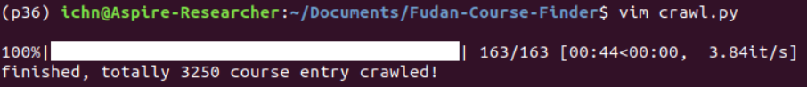

除去选课界面的搜索匹配限制，可以支持关键字包含查询

* 在序号中输入"ENGL"或"PEDU"即可搜索英语课或体育课
* 时间搜索，如"星期一 1-2"
* 地点搜索，如需查找张江开的课，可在地点栏输入"Z"
* 模块课搜索，序号中输入"1190"，基本匹配到的课都是模块课
* 支持开课大纲下载和余量查看，在同一浏览器内登录jwfw并点击一次“开课查询（含大纲）”，之后在本页面点击序号的链接即可下载开课大纲或是点击查看余量跳转到余量查看

**Update**

* upd [2019.02.01] 数据更新为 semester.id=285，即2019年度春季学期。终于重新回到复旦了！
* upd [2018.09.03] 数据更新为semester.id=284，即2018年度秋季学期。欢迎大一萌新们！

---

* 已经更新数据为semester.id=264的数据
* 提供数据抓取文件crawl.py, 只需在header中填入cookie并修改semester.id以及pageNo, python运行即可自动更新
* 
